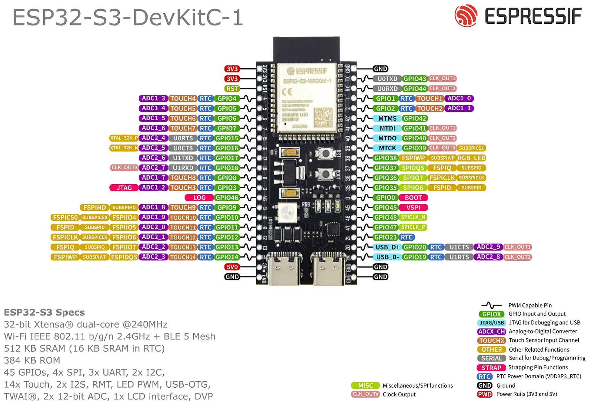

# ESP32_car - 智能遥控小车

<p align="center">
  
</p>

## 项目概述

基于 **ESP32-S3** 芯片、**双 L298N 电机驱动** 与 **微信小程序** 交互的物联网遥控小车。通过 **WebSocket 协议** 实现低延迟实时操控，支持摇杆控制方向、三档调速以及坦克漂移模式。

> 🎓 校内单片机开发综合实训项目 | 2025.12

## 系统架构

```
┌──────────────────┐     WebSocket      ┌─────────────────────┐
│   微信小程序      │ ◄────────────────► │   ESP32-S3 小车       │
│  (摇杆 + UI)     │   ws://IP:81      │   (WebSocket Server) │
│                  │                    │                      │
│  · 虚拟摇杆      │   "forward:180"    │   · WiFi STA 模式    │
│  · 漂移开关      │   "drift_l:255"    │   · 双 L298N 驱动    │
│  · 三档调速      │   "stop:0"        │   · 4 路 PWM 调速    │
│  · 状态指示灯    │                    │   · 断开自动停车     │
└──────────────────┘                    └─────────────────────┘
```

## 硬件架构

### 核心组件

| 组件 | 型号 | 说明 |
|------|------|------|
| 控制器 | ESP32-S3 WROOM-1 | 双核 Xtensa LX7, 240MHz, WiFi + BLE 5.0 |
| 电机驱动 | L298N × 2 | 双 H 桥，驱动 4 路直流电机 |
| 底盘 | 4WD 小车底盘 | 四轮驱动，辐轮镂空 N=20，轮胎直径 66mm |
| 电源 | 7.4V / 12V 电池组 | 经 L298N 板载 5V 稳压供 ESP32-S3 |

### 引脚映射

#### 左侧电机组（电机 A）

| 功能 | 引脚 | 说明 |
|------|------|------|
| IN1 (左前正转) | GPIO 4 | 方向控制 |
| IN2 (左前反转) | GPIO 5 | 方向控制 |
| IN3 (左后正转) | GPIO 6 | 方向控制 |
| IN4 (左后反转) | GPIO 7 | 方向控制 |
| ENA (左组 PWM) | GPIO 1 | 速度控制 (0-255) |
| ENB (左组 PWM) | GPIO 2 | 速度控制 (0-255) |

#### 右侧电机组（电机 B）

| 功能 | 引脚 | 说明 |
|------|------|------|
| IN1 (右前正转) | GPIO 15 | 方向控制 |
| IN2 (右前反转) | GPIO 16 | 方向控制 |
| IN3 (右后正转) | GPIO 17 | 方向控制 |
| IN4 (右后反转) | GPIO 18 | 方向控制 |
| ENA (右组 PWM) | GPIO 42 | 速度控制 (0-255) |
| ENB (右组 PWM) | GPIO 41 | 速度控制 (0-255) |

## 通信协议

### WebSocket 指令格式

```
方向:速度
```

| 指令 | 含义 | 示例 |
|------|------|------|
| `forward:N` | 前进，速度 N | `forward:180` |
| `backward:N` | 后退，速度 N | `backward:120` |
| `left:N` | 普通左转（划弧） | `left:180` |
| `right:N` | 普通右转（划弧） | `right:180` |
| `drift_l:255` | 左漂移（固定满速） | — |
| `drift_r:255` | 右漂移（固定满速） | — |
| `stop:0` | 停车 | — |

### 速度挡位

| 挡位 | PWM 值 | 说明 |
|------|--------|------|
| 低速 🐢 | 120 | 精细操控、狭窄空间 |
| 中速 🚗 | 180 | 日常行驶（默认） |
| 全速 🚀 | 255 | 极速模式（漂移默认） |

## 摇杆控制算法

### 方向判定（atan2 四象限）

微信小程序捕获触摸坐标，计算摇杆偏移向量 `(dx, dy)`，使用 `atan2(dy, dx)` 转换为角度，再划分为四个 90° 扇区：

```
                 90°
                 ↑
         前进 (forward)
   135° ←────────→ 45°
         左          右
   180° ←     ·     → 0°
         (stop<30px)
  -135° ←────────→ -45°
         后退 (backward)
                 ↓
               -90°
```

| 角度范围 | 方向 | 说明 |
|----------|------|------|
| -45° ~ 45° | `right` | 右转 |
| 45° ~ 135° | `backward` | 后退 |
| 135° ~ 180° 或 -180° ~ -135° | `left` | 左转 |
| -135° ~ -45° | `forward` | 前进 |
| 位移 < 30px | `stop` | 死区，防止抖动 |

### 与漂移模式的联动

当**漂移开关打开**时，`left` / `right` 指令被自动替换：

```
left  --[漂移模式]--> drift_l (左侧反转 + 右侧满速正转)
right --[漂移模式]--> drift_r (左侧满速正转 + 右侧反转)
```

## 漂移模式详解

### 物理原理

| 模式 | 左侧电机 | 右侧电机 | 效果 |
|------|----------|----------|------|
| 普通左转 | 停止 | 正转 | 划弧转弯（大半径） |
| 左漂移 | **反转** | 满速正转 | 坦克原地转向（甩尾） |
| 普通右转 | 正转 | 停止 | 划弧转弯（大半径） |
| 右漂移 | 满速正转 | **反转** | 坦克原地转向（甩尾） |

漂移模式下强制 speed=255，瞬时输出最大扭矩，实现原地甩尾效果。

### 代码实现

```cpp
else if (dir == "drift_l") {
    // 左侧电机反转 + 右侧电机满速正转
    digitalWrite(4, LOW);  digitalWrite(5, HIGH);  // 左前反转
    digitalWrite(6, LOW);  digitalWrite(7, HIGH);  // 左后反转
    digitalWrite(15, HIGH); digitalWrite(16, LOW);  // 右前正转
    digitalWrite(17, HIGH); digitalWrite(18, LOW);  // 右后正转
    speed = 255;  // 漂移强制满功耗
}
```

## 安全保护机制

### ① 上电默认停车
```cpp
void setup() {
    // ... 引脚初始化后立即停车
    stopAll();  // 防止上电瞬间电机乱转
}
```

### ② WebSocket 断线自动停车
```cpp
void onWebSocketEvent(...) {
    if (type == WStype_DISCONNECTED) {
        stopAll();  // 手机切后台或信号丢失 → 立即停车，防止撞墙
    }
}
```

### ③ 紧急停止函数
```cpp
void stopAll() {
    for (int i = 0; i < 8; i++) digitalWrite(dirPins[i], LOW);  // 全部方向引脚拉低
    for (int i = 0; i < 4; i++) analogWrite(enPins[i], 0);      // PWM 清零
}
```

## 微信小程序界面

采用**深色竞技风格** UI，包含以下功能区域：

| 区域 | 功能 |
|------|------|
| 状态指示灯 | 🟢 性能模式已激活 / 🔴 尝试连接小车... |
| 虚拟摇杆 | 360° 触摸拖动，实时方向 + 速度控制 |
| Drift 开关 | 🔥 一键切换漂移模式（红色高亮反馈） |
| 三挡调速 | 低速 / 中速 / 全速（紫色选中态） |
| 速度条 | 可视化当前挡位百分比 |
| 震动反馈 | 漂移长震、挡位切换中震、方向切换轻震 |

### 微信小程序文件结构

```
wechat_code/
├── index.js    # 核心逻辑：摇杆计算、WebSocket 连接、漂移联动
├── index.wxml  # 界面布局：摇杆底座、漂移按钮、挡位选择
└── index.wxss  # 样式：深色主题、渐变摇杆、霓虹指示灯
```

## 固件代码结构

项目使用 **PlatformIO + Arduino 框架** 开发：

```
esp32_car/mycar/
├── platformio.ini       # 项目配置（依赖 WebSockets 库）
├── src/
│   └── main.cpp         # 主程序（~150 行）
├── include/             # 头文件目录
├── lib/                 # 本地库目录
└── test/                # 测试目录
```

### 依赖库

```ini
lib_deps =
    links2004/WebSockets @ ^2.4.1  ; WebSocket Server 库
```

## 快速开始

### 1. 硬件连接

按照上方"引脚映射"表格，将双 L298N 驱动板的 IN1~IN4、ENA/ENB 连接到 ESP32-S3 对应 GPIO。

### 2. 配置 WiFi 热点

修改 `src/main.cpp` 中的 WiFi 配置：

```cpp
const char* ssid = "你的手机热点名称";
const char* password = "你的热点密码";
```

> ⚠️ **注意**：小车连接手机 2.4GHz 热点，ESP32-S3 不支持 5GHz WiFi。

### 3. 编译与烧录

```bash
# 安装 PlatformIO（推荐 VS Code 插件）
# 打开 esp32_car/mycar 目录

# 编译
pio run

# 烧录（将 ESP32-S3 通过 USB 连接电脑）
pio run -t upload

# 查看串口输出（获取小车 IP 地址）
pio device monitor
```

### 4. 配置微信小程序

1. 打开 `wechat_code/index.js`
2. 将 `initSocket()` 中的 IP 地址改为串口打印的小车 IP：
   ```javascript
   initSocket() {
       this.socket = wx.connectSocket({ url: 'ws://你的小车IP:81' });
       // ...
   }
   ```
3. 使用微信开发者工具打开 `wechat_code/` 目录
4. 点击编译预览，手机扫码即可操控

### 5. 调试流程

```
手机开热点 (2.4GHz)
    ↓
ESP32-S3 上电 → 连接热点 → 串口打印 IP
    ↓
微信小程序填入 IP → WebSocket 连接
    ↓
状态灯变绿 🟢 → 开始操控！
```

## 项目文件说明

| 文件 | 用途 |
|------|------|
| `esp32_car/mycar/src/main.cpp` | ESP32-S3 固件主程序 |
| `esp32_car/mycar/platformio.ini` | PlatformIO 项目配置 |
| `wechat_code/index.js` | 小程序核心逻辑 |
| `wechat_code/index.wxml` | 小程序界面布局 |
| `wechat_code/index.wxss` | 小程序样式 |
| `*.pdf` | 数据手册（ESP32-S3、L298N） |
| `*.jpg / *.png` | 引脚图、实物照片 |

## 技术栈

`ESP32-S3` `L298N` `WebSocket` `PlatformIO` `Arduino` `C++` `微信小程序` `JavaScript` `PWM` `四驱底盘`

## 常见问题

<details>
<summary><b>Q: 小车连不上 WiFi？</b></summary>

1. 确认手机热点为 **2.4GHz**（ESP32-S3 不支持 5GHz）
2. 检查 SSID 和密码拼写是否正确
3. 查看串口监视器输出，观察连接状态
</details>

<details>
<summary><b>Q: 小程序连不上小车？</b></summary>

1. 确认手机和小车**连接同一个热点**
2. 检查 `index.js` 中 IP 地址是否正确（每次重启小车可能变）
3. 确认端口号为 `81`
4. 小程序开发工具中勾选"不校验合法域名"
</details>

<details>
<summary><b>Q: 漂移模式不甩尾？</b></summary>

1. 确认电池电量充足（漂移需要瞬时大电流）
2. 检查轮胎与地面摩擦力（光滑地面效果更好）
3. 确认 `speed` 被强制设为 255
</details>

<details>
<summary><b>Q: 小车不受控自己跑？</b></summary>

1. 检查 L298N 的 IN 引脚是否有悬空（浮空可能导致误触发）
2. 确认 `setup()` 中调用了 `stopAll()`
3. 检查共地连接是否良好
</details>

## 未来扩展

- [ ] **HC-SR04 超声波避障**：通过 GPIO 接入超声波传感器，实现自动刹车
- [ ] **摄像头图传**：利用 ESP32-S3 的摄像头接口实现实时视频流
- [ ] **电池电量监测**：分压电路测量电池电压，小程序界面同步显示
- [ ] **PID 速度闭环**：加入编码器实现精确速度控制
- [ ] **多车对战**：WebSocket 广播实现多车协同/对抗

## 许可证

MIT License